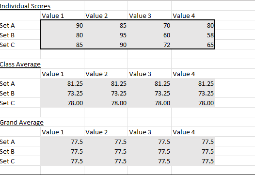
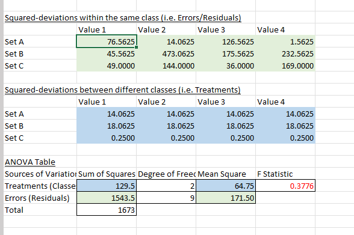
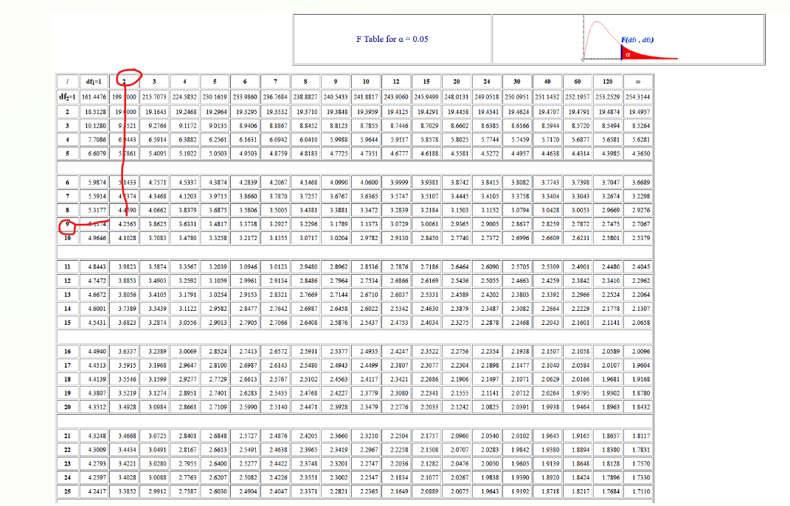

# anova tables

### Data table

There are three components presented in this table

1. individual scores
    - This is the score for every participant in every independent sample for testing

2. class average
    - The average of all scores in one row

3. grand average
    - the average of every individuals score across all sample data

### individual scores

each grid section containts one participants data from their respective set

|individual scores|value 1|value 2|value3|value 4|
|--|--|--|--|--|
|Set A|90|85|70|80|
|Set B|80|95|60|58|
|Set C|85|90|72|65|

### class average

each row is averaged out. lets take set a from above

$ \frac{90 + 85 +70 + 80}{4} = 81.25$ 

we now fill each grid section for set A with the average score of that treatments participants

|class average |value 1|value 2|value3|value 4|
|--|--|--|--|--|
|Set A|**81.25**|**81.25**|**81.25**|**81.25**|
|Set B|73.25|73.25|73.25|73.25|
|Set C|78.00|78.00|78.00|78.00|

### Grand average

we take the scores of each individual in each row and average it

$\frac{90+	85+	70+	80+
80	+95	+60	+58+
85	+90+	72+	65}{12} = 77.5$

We fill every grid section with the **grand average** (77.5)

|Grand average|value 1|value 2|value3|value 4|
|--|--|--|--|--|
|Set A|77.5|77.5|77.5|77.5|
|Set B|77.5|77.5|77.5|77.5|
|Set C|77.5|77.5|77.5|77.5|

# solving the data

### squared deviation withing the same class i.e Errors/residuals

We have several steps here.

the squared deviation formula for each indivual within the same class is

${(individual score - class average)}^2$

|individual scores|value 1|value 2|value3|value 4|
|--|--|--|--|--|
|Set A|90|85|70|80| 
|Set B|80|95|60|58|
|Set C|85|90|72|65|

|class average |value 1|value 2|value3|value 4|
|--|--|--|--|--|
|Set A|**81.25**|**81.25**|**81.25**|**81.25**|
|Set B|73.25|73.25|73.25|73.25|
|Set C|78.00|78.00|78.00|78.00|

|squared deviations within the same class |value 1|value 2|value3|value 4|
|--|--|--|--|--|
|Set A|**76.5625**|**14.0625**|**126.5625**|**1.5625**|
|Set B|||||
|Set C|||||

the values we get and enter into each grid section are call errors/residuals 

it displays the Error variability of each treatment

### Squared deviations between different classes (treatments)

|individual scores|value 1|value 2|value3|value 4|
|--|--|--|--|--|
|Set A|90|85|70|80| 
|Set B|80|95|60|58|
|Set C|85|90|72|65|

|Grand average|value 1|value 2|value3|value 4|
|--|--|--|--|--|
|Set A|77.5|77.5|77.5|77.5|
|Set B|77.5|77.5|77.5|77.5|
|Set C|77.5|77.5|77.5|77.5|

to get each rows value the formula is

$(class average - Grand average)^2$

|squared deviations between different classes (rows) |value 1|value 2|value3|value 4|
|--|--|--|--|--|
|Set A|**14.0625**|**14.0625**|**14.0625**|**14.0625**|
|Set B|**18.0625**|**18.0625**|**18.0625**|**18.0625**|
|Set C|**0.2500**|**0.2500**|**0.2500**|**0.2500**|

### filling the anova table

|Source of variation|sum of squares|degrees of freedom|Mean square|F stat|
|--|--|--|--|--|
|Treatments|129.5|2|64.75|0.3776|
|Errors(residuals)|1543.5|9|171.50|N/A|
|Total|1673|N/A|N/A|N/A|

formulas below

|Source of variation|sum of squares|degrees of freedom|Mean square|F stat|
|--|--|--|--|--|
|Treatments|SUM ofsquared deviations between different classes values | Number of rows - 1| sum of squares / degrees of freedom| mean square(treatment) divided by mean square (errors)|
|Errors|SUM ofsquared deviations between different classes (rows)| number of grid section - number of rows i.e 12-3| sum of squares / degrees of freedom||

## getting $F_{crit}$

look at a F-table online and find the section for your significance level

df1 (row  number) is your treatments degree of freedom

df2 (column number) is your errors degree of freedom

for df1(2) and df2(9) our $f_{crit}$ is 4.2565

